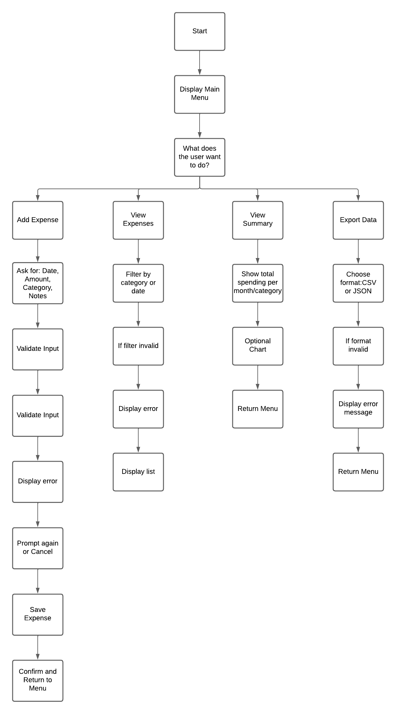
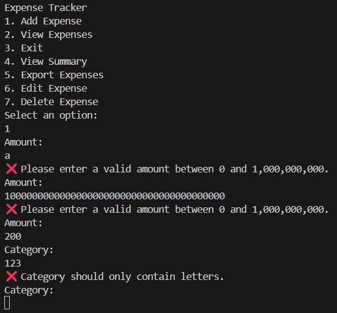

# 💸 Expense Tracker CLI

# Expense Tracker CLI Application

This Expense Tracker is a Python-based command-line tool designed to help users efficiently manage daily expenses. With features to add, view, edit, delete, summarize, and export expenses, it provides a structured and easy-to-use interface for personal finance tracking.

By organizing spending data by category and month, the tracker helps users gain valuable insights into their financial habits and make better-informed budgeting decisions.

This expense tracker is live, to access it [click here](https://expense-tracker-ma-60ad3c87f968.herokuapp.com/).


---

## Table of Contents

- [How to use](#how-to-use)
- [Project Planning](#Project-Planning)
- [Features](#features)
- [Future Features](#future-features)
- [Data Model](#-data-model)
- [Testing](#-testing)
- [Bugs](#-bugs)
- [Validator Testing](#-validator-testing)
- [Technologies Used](#-Technologies-Used)
- [Credits](#-credits)

---

## How to Use

The **Expense Tracker CLI** is a Python-based command-line application designed to help users track, manage, and review their daily spending directly from the terminal.

Upon launching the program, a menu is displayed with numbered options.

Users interact with the app by selecting an option from the menu using keyboard inputs.

You can perform the following actions:

- **1. Add Expense**  
  Input the amount, category (e.g., food, transport), and optional notes for each expense entry.

- **2. View Expenses**  
  Display a list of all saved expenses including the date, category, amount, and notes.

- **3. Exit**  
  Quit the application.

- **4. View Summary**  
  View a breakdown of expenses by month and category, helping you analyze your spending patterns.

- **5. Export Expenses**  
  Export all saved expenses to a **CSV** or **JSON** file, saved in the `exports/` folder.

- **6. Edit Expense**  
  Select an existing expense using its ID prefix and update its amount, category, or notes.

- **7. Delete Expense**  
  Remove an unwanted expense entry by selecting it using the ID prefix and confirming deletion.


---
## Project Planning

The purpose of this project is to help users manage and monitor their personal expenses using a terminal-based CLI application. The user can input daily spending, view past records, analyze expenses by month and category, and export the data.

The structure and user flow were designed using the following flowchart:


1. CLI & Menu Setup
Built the command-line interface with a looping menu to handle user interactions like adding, viewing, or exporting expenses.

2. Expense Input & Storage
Implemented input validation and saved expense data (amount, category, notes) to a persistent JSON file for session continuity.

3. Summary & Export Features
Added summary views by category and month, along with CSV/JSON export functionality for user data management.

4. Error Handling & UX
Enhanced input validation and user feedback, ensuring a smooth experience with clear prompts and error messages.

This planning phase ensured the CLI app remains user-friendly, reliable, and expandable for future feature additions like chart generation, cloud sync, or detailed filtering.

---
## Features

- **Interactive Command-Line Menu**
  - Simple number-based navigation.
  - Color-coded messages and intuitive prompts.
  - Screenshot suggestion: Take a screenshot of the main menu when the app starts.


- **Add Expense**
  - Users can input amount, category, and optional notes.
  - Validation checks for valid numbers and non-empty categories.
  - Screenshot suggestion: Show adding an expense and the success message.


- **View Expenses**
  - Displays all expenses in a clean tabular format.
  - Shows ID, date, category, amount, and notes.
  - Screenshot suggestion: After adding 2–3 expenses, run "View Expenses" and capture the list.


- **Edit Expense**
  - Edit amount, category, and notes using the expense's ID.
  - Prompts show current values as defaults.
  - Screenshot suggestion: Editing an expense where one field is updated.


- **Delete Expense**
  - Allows selecting an expense by ID and confirms deletion.
  - Screenshot suggestion: Show deletion confirmation step.


- **View Summary**
  - Provides a summary of total spending by **month** and by **category**.
  - Useful for budgeting and identifying patterns.
  - Screenshot suggestion: Show a summary with multiple months and categories.


- **Export to File**
  - Choose between CSV or JSON export.
  - Saves to `/exports` folder.
  - Screenshot suggestion: Show confirmation message of a successful export.


- **Input Validation**
  - Prevents empty or invalid values.
  - Ensures numeric amounts and proper category names.



---
## Future Features

- Provide an **undo/redo** functionality when editing or deleting expenses.
- Add support for **recurring expenses** (e.g., monthly subscriptions).
- Enable **filtering/searching** by date range, amount, or category.
- Create a **“budget mode”** that warns users when they're close to a set limit.
- Add **visual charts** when exporting (e.g., pie charts in JSON/CSV output or external HTML report).
- Include **currency support** and exchange rate integration.
- Add **password protection** or encryption for sensitive financial data.
- Allow **backup and restore** options for expense data.


## Data Model

The Expense Tracker CLI uses a simple and efficient data model built on **Python dictionaries** and **JSON files** to store and manage financial records. Each expense is represented as a dictionary containing the following keys:

- `id`: A unique identifier generated with `uuid4`
- `date`: The current date of entry in `YYYY-MM-DD` format
- `amount`: A float value representing the amount spent
- `category`: A user-defined category for the expense (e.g., Food, Travel)
- `notes`: Optional text input for additional context

All expenses are stored persistently in a single JSON file (`expenses.json`) located in the `data/` directory. When a user adds, edits, or deletes an expense, the JSON file is updated in real-time to ensure data consistency across sessions.

This structure allows for easy access and manipulation of expense data, enabling features such as monthly summaries, category analysis, and export to CSV/JSON formats.

---

## Testing

The Expense Tracker CLI application was manually tested to ensure functionality and error handling. Below are the testing strategies and outcomes:

### Manual Testing Steps

- Passed the code through a PEP8 linter and confirmed there are no syntax errors or formatting issues.
- Tested invalid inputs:
  - Entering text instead of numbers in amount field.
  - Submitting empty inputs for required fields.
  - Typing invalid menu options (e.g., numbers outside the valid range or letters).
- Verified expense records were properly stored in the `expenses.json` file after being added.
- Verified that editing and deleting expenses correctly updated the JSON file.
- Confirmed that exported CSV and JSON files were correctly generated and contained valid data.
- Confirmed the application runs in both the local terminal and Code Institute's Heroku terminal.
- Confirmed the menu loops until exit is selected and handles edge cases gracefully.

---

## Bugs

### Fixed Bugs

- **CSV Export Error (`id` field not found)**  
  The `DictWriter` raised a `ValueError` because the `id` field was not included in the fieldnames list.  
  **Fix:** A filtered version of each expense dictionary was passed to the writer:
  ```python
  filtered = [{k: e[k] for k in ["date", "amount", "category", "notes"]} for e in expenses]
  writer.writerows(filtered)

### Remaining Bugs
None. All known issues have been resolved during testing.
---
## Validator Testing
PEP8 Validator [PEP8](http://pep8online.com/):

All Python files were tested.
No errors returned.

---

##  Technologies Used

### Programming Languages
- Python 3.10+

### Frameworks, Libraries & Programs
- **GitHub** – For repository hosting and version control.
- **Git** – Used for local version control and pushing code to GitHub.
- **Heroku** – Deployed using Code Institute’s Heroku terminal template.
- **VSCode** – Code editing and running the terminal locally.
- **JSON** – Used to store and load expenses data persistently.
- **CSV** – Used for exporting data in spreadsheet-compatible format.
- **Python Standard Libraries**:
  - `datetime` – For date formatting and summary filtering.
  - `uuid` – For generating unique expense IDs.
  - `collections.defaultdict` – Used for summarizing expenses by month/category.
  - `pathlib` – For handling file paths across platforms.

---

##  Deployment

This application is deployed via Heroku using Code Institute’s terminal-based deployment template.

To deploy:

1. Fork this repo and clone it to your IDE
2. Push to a new public GitHub repo
3. Create a new Heroku app
4. Connect Heroku to the GitHub repo
5. Ensure the following files are present:
    - `requirements.txt`
    - `runtime.txt`
    - `Procfile`
6. Use the CI terminal Heroku template so `input()` works correctly
7. Deploy the branch and open the app via **Heroku > Open App**
---

## Credits

### Code
- [Code Institute](https://codeinstitute.net/) – Terminal template and deployment guidance.
- NumPy Library [Official NumPy](https://numpy.org/).
- Love-sandwiches walkthorugh project provided by [Code Institute](https://codeinstitute.net/global/)
- Fuzzywuzzy library [Offical Python documentation](https://pypi.org/project/fuzzywuzzy/).
- The exporter [video](https://www.youtube.com/watch?v=V5sEAq9n_4A)

---

 
### Acknowledgments

- **Jubril Akolade** My Code Institute Mentor.
-  [Oscar Nain Borja Cruz](https://co.linkedin.com/in/oscar-borja-stts) - He is one of my parents best friend and he took the time to walk through my code with me when I was struggling with adding event listeners.
- **The Code Institute Slack channel Peer Code Review** - There were similar cases from the ones I was facing and the community always tried to help.