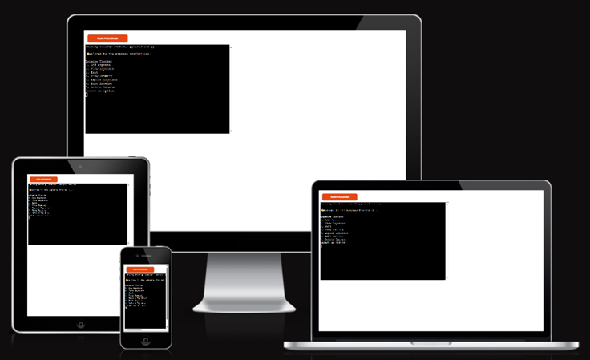
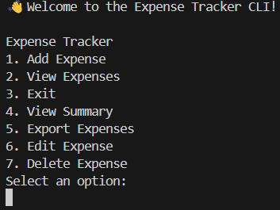
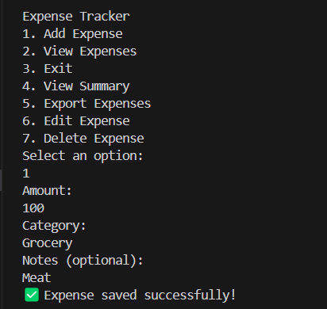
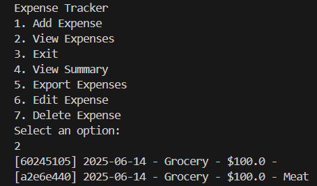
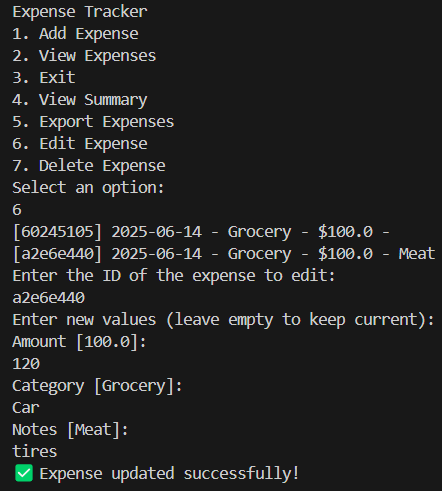
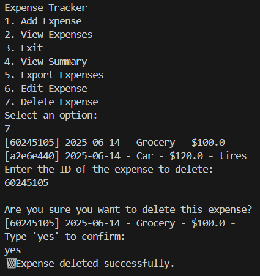
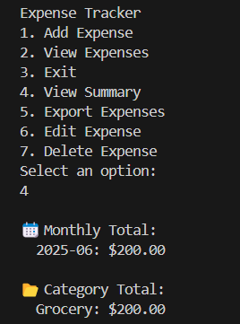
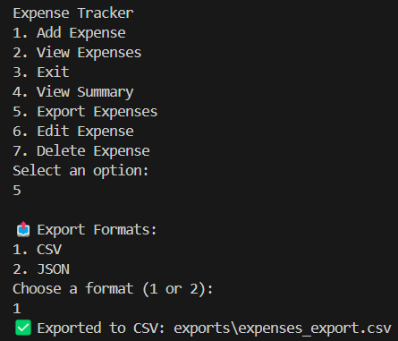

# 💸 Expense Tracker CLI

# Expense Tracker CLI Application

This Expense Tracker is a Python-based command-line tool designed to help users efficiently manage daily expenses. With features to add, view, edit, delete, summarize, and export expenses, it provides a structured and easy-to-use interface for personal finance tracking.

By organizing spending data by category and month, the tracker helps users gain valuable insights into their financial habits and make better-informed budgeting decisions.

This expense tracker is live, to access it [click here](https://expense-tracker-ma-60ad3c87f968.herokuapp.com/).



---

## 📚 Table of Contents

- [How to use](#how-to-use)
- [Features](#features)
- [Future Features](#future-features)
- [Data Model](#-data-model)
- [Testing](#-testing)
- [Bugs](#-bugs)
- [Validator Testing](#-validator-testing)
- [Deployment](#-deployment)
- [Credits](#-credits)

---

## 🛠️ How to Use

The **Expense Tracker CLI** is a Python-based command-line application designed to help users track, manage, and review their daily spending directly from the terminal.

Upon launching the program, a menu is displayed with numbered options.

Users interact with the app by selecting an option from the menu using keyboard inputs.

You can perform the following actions:

- **1. Add Expense**  
  Input the amount, category (e.g., food, transport), and optional notes for each expense entry.

- **2. View Expenses**  
  Display a list of all saved expenses including the date, category, amount, and notes.

- **3. Exit**  
  Quit the application.

- **4. View Summary**  
  View a breakdown of expenses by month and category, helping you analyze your spending patterns.

- **5. Export Expenses**  
  Export all saved expenses to a **CSV** or **JSON** file, saved in the `exports/` folder.

- **6. Edit Expense**  
  Select an existing expense using its ID prefix and update its amount, category, or notes.

- **7. Delete Expense**  
  Remove an unwanted expense entry by selecting it using the ID prefix and confirming deletion.


---

## ✅ Features

### Existing Features

- **Interactive Command-Line Menu**
  - Simple number-based navigation.
  - Color-coded messages and intuitive prompts.
  - Screenshot suggestion: Take a screenshot of the main menu when the app starts.



- **Add Expense**
  - Users can input amount, category, and optional notes.
  - Validation checks for valid numbers and non-empty categories.
  - Screenshot suggestion: Show adding an expense and the success message.



- **View Expenses**
  - Displays all expenses in a clean tabular format.
  - Shows ID, date, category, amount, and notes.
  - Screenshot suggestion: After adding 2–3 expenses, run "View Expenses" and capture the list.



- **Edit Expense**
  - Edit amount, category, and notes using the expense's ID.
  - Prompts show current values as defaults.
  - Screenshot suggestion: Editing an expense where one field is updated.



- **Delete Expense**
  - Allows selecting an expense by ID and confirms deletion.
  - Screenshot suggestion: Show deletion confirmation step.



- **View Summary**
  - Provides a summary of total spending by **month** and by **category**.
  - Useful for budgeting and identifying patterns.
  - Screenshot suggestion: Show a summary with multiple months and categories.



- **Export to File**
  - Choose between CSV or JSON export.
  - Saves to `/exports` folder.
  - Screenshot suggestion: Show confirmation message of a successful export.



- **Input Validation**
  - Prevents empty or invalid values.
  - Ensures numeric amounts and proper category names.

---

## 📝 Overview

This project was developed as part of Code Institute’s Portfolio Project 3 for the Diploma in Full Stack Software Development. The CLI app allows users to log and track their expenses, providing a streamlined way to manage budgeting from the terminal.

---


## 💻 Technologies

- **Python 3.10+**
- **JSON** (for data persistence)
- **datetime** & **collections** (standard libraries)
- **Heroku** (for deployment)
- **Code Institute Heroku Template** (to enable terminal-based interaction)

---

## 🚀 Deployment

This application is deployed via Heroku using Code Institute’s terminal-based deployment template.

To deploy:

1. Fork this repo and clone it to your IDE
2. Push to a new public GitHub repo
3. Create a new Heroku app
4. Connect Heroku to the GitHub repo
5. Ensure the following files are present:
    - `requirements.txt`
    - `runtime.txt`
    - `Procfile`
6. Use the CI terminal Heroku template so `input()` works correctly
7. Deploy the branch and open the app via **Heroku > Open App**

> ❗ Note: This project is **terminal-based** and will not run as a web page.

---


## 📁 File Structure

```bash
expense-tracker/
│
├── controllers/
│   └── expense_controller.py
│   └── exporter.py
│
├── views/
│   └── cli.py
│
├── run.py
├── requirements.txt
├── Procfile
├── runtime.txt
├── README.md
├── expenses.json
